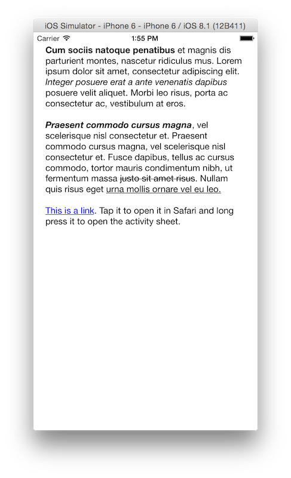

## INDLinkLabel
### A simple, no frills `UILabel`-alike with support for links

All I wanted was a label that was exactly like `UILabel`, except with support for handling taps on links. I didn't want a loads of additional styling properties or built in support for parsing links and hashtags. I just wanted to be able to give it an `NSAttributedString` that had links already marked using `NSLinkAttributeName` and have it handle taps on those links like the way `UITextView` does. I couldn't find an existing project that met that critiera so I built this.

Run the example app to see it in action:

### API

The API is very similar to `UILabel`'s, although it is not a drop-in replacement as it doesn't implement things like adjusting the font size to fit the text.

#### Styling

All of `UILabel`s text styling attributes are supported. There are also two additional properties, `linkHighlightColor` and `linkHighlightCornerRadius` for changing the appearance of the overlay that appears over a link when it is touched.

#### Handling Link Actions

Handling both taps and long presses on links is supported, through the `linkTapHandler` and `linkLongPressHandler` properties, respectively. If `linkTapHandler` is not set, it will default to opening the link using `UIApplication.openURL()`.

### Contact

* Indragie Karunaratne
* [@indragie](http://twitter.com/indragie)
* [http://indragie.com](http://indragie.com)

### License

`INDLinkLabel` is licensed under the MIT License. See `LICENSE` for more information.
